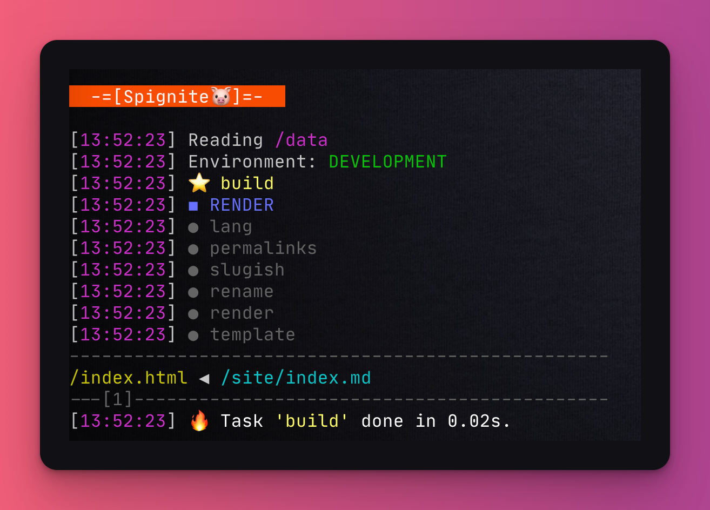

# 👋 Hello World

**Spignite** project is a modern Node project. You should be somewhat familiar with the JavaScript ecosystem - this tool is not for the faint-hearted 💪.

Let's build our first website together! Btw, the example is available on our Github.

### package.json

Create a new folder for your website. Create `package.json` that looks like this (common fields are omitted):


```javascript
{
  // ...
  "type": "commonjs",
  "scripts": {
    "dev": "node spig.mjs dev",
    "build": "node spig.mjs"
  },
  "dependencies": {
    "spignite": "^<version>"
  }
}
```


Nothing crazy, as you can see.


**Spignite** expects certain folder structures to be followed. We will talk more about it later; for now, just keep in mind the whole site is defined in `src` subfolder.


### Markdown site content

Let's make some pages! Create the content for the `index` _page:_


```
Hello **world**!
```


### Templates

**Spignite** works with several template engines. Here we are going to use the awesome [nunjucks](https://mozilla.github.io/nunjucks/):


```markup
<!doctype html>
<html>
  <body>
      {{ content | safe }}
  </body>
</html>
```


### spig.mjs

The last thing is to run **Spignite**. Add the `spig.js` into the root of your project:


```javascript
import { Spig } from "spignite";

Spig
  .on('/**/*.md')

  ._('RENDER')
  .pageLinks()
  .render()
  .applyTemplate()
;

Spig.run();
```


This is the script that builds **Spignite's** website. We will describe it in more detail later. Still, it is quite clear that we define a certain _flow_ of operations over input files. Something like this:&#x20;

1. On all `md` files...
2. in the `RENDER` phase...
3. make page links (i.e. change `.md` to `.html`)...
4. render all `.md` content to HTML...
5. and apply the template.

Easy, right?

### Alternative spig.mjs syntax

Above syntax focuses on operations-per-files. **Spignite** has an alternative syntax that focuses on operations-per-phases. It looks like this:


```javascript
import { Spig } from "spignite";

const md = Spig.on("/**/*.md")

Spig.phase("RENDER", (on) => {
  on(md)
    .pageLinks()
    .render()
    .applyTemplate();
});

Spig.run();
```


Both syntaxes work the same. It is your preference which one to use, and when.


We will talk more about processing a bit later.


### Run! 🚀

That's all - execute the following in projects root and sit and enjoy the show!

```bash
npm install && npm run build
```

The output would be similar to this:

<figure><figcaption><p>Spignite in action!</p></figcaption></figure>

Check out the `out` folder! The `index.html` awaits:


```markup
<!doctype html>
<html>
  <body>
      <p>Hello <strong>world</strong>!</p>
  </body>
</html>
```


Your site is ready!
