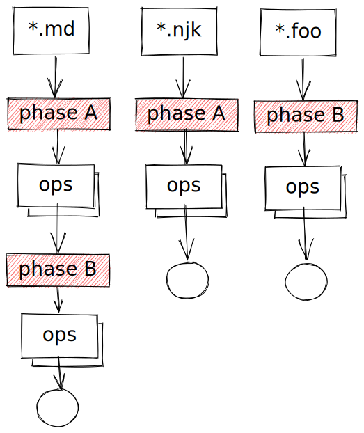

# ⚙ Processing

There are three important concepts in the **Spignite**, regarding the build process:

1. **Files set** - set of input files, defined by, e.g., a glob pattern or programmatically created 'virtual' files (that do not exist in the content folders).
2. **Operation** - unique file transformation. The operation takes the input content and processes it. The result may be processed content (e.g., markdown rendered to HTML) but also gathered meta-data.\
   _Operations are executed in parallel!_
3. **Phase** - a collection of file operations that will be executed together. The next phase will not start until the current phase finishes. Phases are used to synchronize operations - as they run parallel. Some operations depend on the results of all previous operations. For example, an operation may depend on the metadata that is resolved from different input sets. Phases are also used to logically group and order operations, too.\
   _Phases are executed serial, one after the other._

What is the **Spignite** way of processing files? <mark style="color:green;">Files are processed by parallel operations that are grouped in serial phases</mark>. That's all :)

### Two syntaxes

As we saw in the Hello World example, **Spignite** offers two syntaxes.

#### **operations-per-files**

We define the file set and then just list _all_ operations on the file set in order. Obviously, there must be a way to group operations in phases. This is done by adding a phase marker between two phases, indicating the current phase is over, and the next phase starts. Something like this:



We define all operations on each file set. Operations on the third file set will execute in phase B after all operations of phase A finish (for the first two file sets).

#### operations-per-phases

One downside of the above syntax is that it might be less visible how operations are grouped per phase, especially if the source code gets larger.

The alternative is to simply group operations per phase, in a more developer-common way. Now we first define all the file sets separately and assign them to constant variables. Then, we define a phase with operations on every included file set.


Here we define operations per phase.

### Examples

Let's see an example:

```javascript
const { Spig } = require('spignite');

Spig.on('/**/*.md')
    ._('ONE')
    .op1()
    .op2()
    ._('TWO')
    .op3();
    
Spig.on('/**/*.txt')
    ._('ONE')
    .opA()
    .opB()
    _('TWO')
    .op3();
    
Spig.run();
```

Here we defined 2 sets of files with `Spig.on()`.  The first set is a set of markdown files, the second set is set of text files. Sets may overlap, if you wish.

The first set defines 3 operations. Regarding the markdown files,  the operations are executed one after the other: `op1`, `op2`, `op3`. The second set defines 3 operations, too: `opA`, `opB`, `op3`.

Phases regulate synchronization between the sets! Let's say that `op3` requires that _all_ previous operations on both sets are completed. By grouping operations as above we make sure that four operations: `op1`, `op2`, `opA`, `opB` are executed in the phase `ONE`, and only then the operation `op3` in the phase `TWO`.

Let's see the following example:

```javascript
const { Spig } = require('spignite');

Spig.on('/**/*.md')
    ._('META')
    .op1()
    ._('RENDER')
    .op2()
    ;
    
Spig.on('/**/*.jpg')
    ._('META')
    .opA()
    _('ASSETS')
    .opB();
    
Spig.run();
```

Again, 2 sets, this time with 3 phases. Here is the order of operation execution:

* `op1` and `opA` runs in parallel. There is no guarantee of the order.
* `op2`
* `opB`

Phases are defined first time when they are used in the code. Phases are executed in order as they are defined. In this example, they are executed in this order: `META`, `RENDER`, `ASSETS`. Although `META` repeats in the second set, it is defined in the first one (as there it appears for the first time).


In rare cases you might want to predefine the phases order. You can do that using `Sping.phases()` method.


### BEFORE- and AFTER- phases

Each phase definition defines 2 more phases - one that is executed before and one that is executed after that phase. They are named by adding the suffixes: `^BEFORE` and `^AFTER` to the phase name, or, better, by using `_AFTER()`and `_BEFORE()` methods. They can be used instead of adding new phases. The previous example could be written like this:

```javascript
const { Spig } = require('spignite');

Spig.on('/**/*.md')
    ._('META')
    .op1()
    ._('RENDER')
    .op2()
    ;
    
Spig.on('/**/*.jpg')
    ._('META')
    .opA()
    _AFTER('RENDER')
    .opB();
    
Spig.run();
```

It's up to you what you wanna use. General (personal) rule-of-thumb is to use Pre/Post phases only to simplify and reduce the number of phases.
